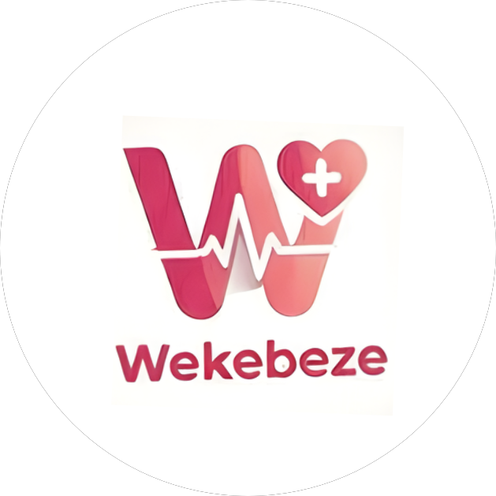

#  Wekebeze — Cancer Awareness Platform

Wekebeze is a modern, premium, and empathetic digital health platform designed to raise awareness about **Cervical and Breast Cancer**. It combines clinical trust with a fluid user experience to help users learn, assess their knowledge, and locate verified screening centers.

## ✨ Core Features

- **🛡️ Awareness Dashboard**: Comprehensive guides and information about cancer prevention and early signs.
- **💬 Conversational UI**: A sophisticated, AI-driven chat experience that provides empathetic health information.
- **📊 Knowledge Check (Quiz)**: Real-time interactive quizzes with instant feedback and animated progress tracking.
- **📍 Screening Locator**: A map-integrated locator to help users find verified screening centers with detailed service information.
- **🌍 Bi-lingual Support**: Full support for both **English** and **Luganda**, ensuring accessible health information for all.

## 🚀 Tech Stack

- **Frontend**: React 18, Vite, TypeScript
- **Styling**: Tailwind CSS (with custom design system)
- **Animations**: Framer Motion (staggered transitions, rhythmic typing indicators)
- **Icons**: Lucide React
- **Backend as a Service**: Supabase (Database, Real-time APIs, Auth)
- **Maps**: React-Leaflet (with custom marker systems)

## 🛠️ Getting Started

### 1. Prerequisites
- [Node.js](https://nodejs.org/) (v16+)
- npm or yarn

### 2. Environment Setup
The project requires Supabase credentials to function correctly. Ensure you have a `.env` file in the **root directory** with the following keys:

```env
VITE_API_BASE_URL=/api
VITE_SUPABASE_URL=https://your-project-id.supabase.co
VITE_SUPABASE_ANON_KEY=your-anon-key
```

### 3. Installation
Clone the repository and install the dependencies:

```bash
npm install
```

### 4. Running Locally
To start the development server:

```bash
npm run dev:frontend
```
Open [http://localhost:5173](http://localhost:5173) to view the application.

### 5. Production Build
To create a production-optimized build:

```bash
npm run build
```

## 📂 Folder Structure

```text
├── assets/                  # Shared image and media assets
├── frontend/
│   └── src/
│       ├── components/      # Reusable UI components (FloatingInput, ChatBubble, etc.)
│       ├── features/        # Feature-based pages (Auth, AwarenessHub, Welcome)
│       ├── services/        # API and external integrations (Supabase client)
│       └── utils/           # Helper functions and i18n
├── public/                  # Static assets served directly
├── index.html               # Main entry HTML
└── tailwind.config.cjs      # Custom design tokens (Slates, Roses, Teals)
```

## 🤝 Contribution

This platform is built with a focus on empathy and clinical trust. Ensure any design or content updates align with the [UI_UX_RECOMMENDATIONS.md](UI_UX_RECOMMENDATIONS.md) established for the project.

---
*Empowering health through knowledge and empathy.*# wekebeze-app
# wekebeze-app
